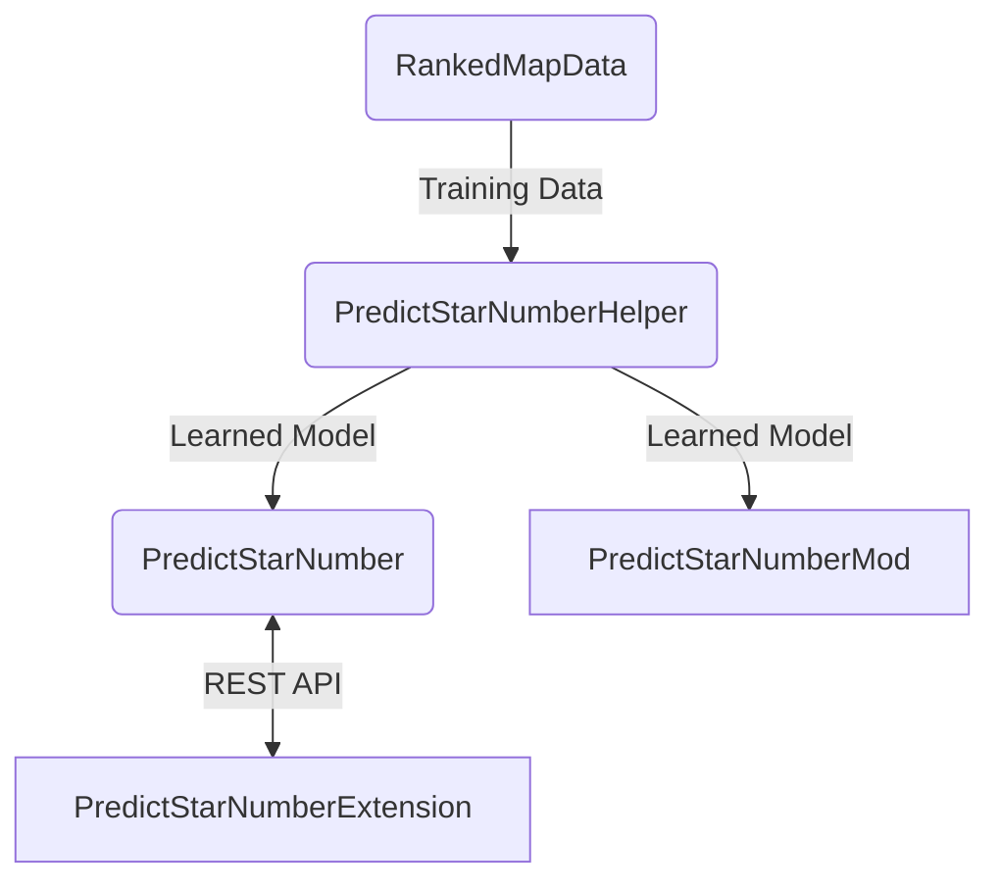

## 日本語版READMEは[こちら](README_JP.md)

# RankedMapData

## What is this?
This is a csv of the ranked maps data you can get mainly from BeatSaver API. 
This is a csv of the data about maps themselves, so it does not include the PP-related data you can get from ScoreSaber. 
~~I have it set to update every 3 hours now.~~ 
~~It will update only for the added ranked maps every hour, and update all the map data for the 9:00 am Japan time update.~~
It gets all the map data at the 9:00 am Japan time

## Relevant Link

Training Data : https://github.com/rakkyo150/RankedMapData  
Model : https://github.com/rakkyo150/PredictStarNumberHelper  
Mod : https://github.com/rakkyo150/PredictStarNumberMod  
Chrome Extension : https://github.com/rakkyo150/PredictStarNumberExtension  

## Data Item Description
 think you can understand most of it, but I'll explain it here. 
To be honest, I'm not sure about some of the items, so if there are any mistakes, I'd appreciate it if you could let me know. 

|Item|Description|
|:---|:---|
|id|The one used in bsr|!
|leaderboardId|the one at the end of each ScoreSaber score link|
|hash|hash of the map|
|name|name of the map|
|description|map description|
|uploaderId|uploader id|
|uploaderName|uploader name|
|uploaderHash|uploader hash|
|uploaderAvatar|uploader icon|
|uploaderLoginType|uploader login type|
|uploaderCurator|the uploader is a curator or not|
|uploaderVerifiedMapper|the uploader is verified or not|
|bpm|Beat Per Minute|
|duration|length of the whole map in seconds|
|songName|song name|
|songSubName|song sub name|
|songAuthorName|song author name|
|levelAuthorName|map author name|
|plays|number of all plays|
|dailyPlays|number of daily plays|
|downloads|number of downloads(I do not know why, but all is 0)|
|upvotes|number of upvotes|
|downvotes|number of downvotes|
|upvotesRatio|upvotes ratio|
|uploadedAt|Date and time when the map was first uploaded|
|createdAt|Date and time when the map was created|
|updatedAt|Date and time when the map info was updated|
|lastPublishedAt|the latest Date and time when the map itself was published|
|automapper|automapper or not|
|qualified|the map is qualified or not|
|loved|the map is loved or not|
|difficulty|difficulty of the score (Easy to ExpertPlus)|
|sageScore|how much the map is like what is made with BeatSage|
|njs|Notes Jump Speed (in m/s)|
|offset|offset|
|notes|number of notes|
|bombs|number of bombs|
|obstacles|Number of walls|
|nps|Notes Per Second|
|length|Probably the time of the score, excluding the blank space before and after(the unit seems to be beat)|
|characteristic|play mode of the map|
|events|Number of light events|
|chroma|whether the map is using chroma|
|me|Whether the map is using MapppingExtentions|
|ne|Whether the map is using NoodleExtentions|
|cinema|whether Cinema Mod is supported|
|seconds|the duration of the map in seconds, excluding maybe the blank space before and after|
|errors|Number of errors in the map|
|warns|number of warns in the map|
|resets|number of resets in the map|
|positiveModifier|modifiers reflect on score or not|
|stars|number of the map star|
|maxScore|combo multiplied max score|
|downloadUrl|map download url|
|coverUrl|map cover url|
|previewUrl|map preview url|
|tags|map tags|
