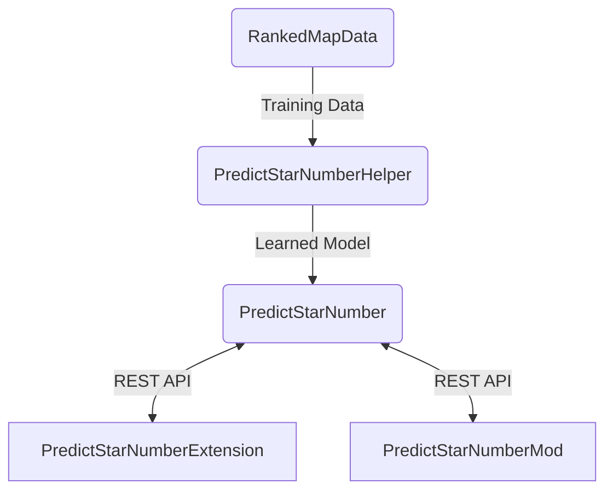

## The English version of README is [here](README.md)

# RankedMapData

## これは何？
BeatSaverを中心として取得できるランク譜面のデータのcsvです 
あくまで譜面そのもののデータを集めたcsvなので、ScoreSaberから取得できるPP関係のデータは含まれていません 
~~今は３時間ごとに更新する設定にしています~~ 
~~１時間ごとに追加されたランク譜面の分だけ更新、日本時間の９時台の更新にはすべての譜面のデータを更新します。~~
日本時間の９時ごろにすべての譜面のデータを取得します。

## 関連リンク

Training Data : https://github.com/rakkyo150/RankedMapData  
Model : https://github.com/rakkyo150/PredictStarNumberHelper  
Mod : https://github.com/rakkyo150/PredictStarNumberMod  
Chrome Extension : https://github.com/rakkyo150/PredictStarNumberExtension  

## ダウンロード先
[こちら](https://github.com/rakkyo150/ScoreSaberRankData/releases) からダウンロードできます

## データ項目の説明
だいたいわかると思いますが、一応説明しておきます 
正直よくわからない項目もあるので、間違いなどありましたら教えていただけるとありがたいです 
|項目|説明|
|:---|:---|
|id|!bsrで使われるやつ|
|leaderboardId|ScoreSaberの各譜面のリンクの末尾にあるやつ|
|hash|譜面のハッシュ|
|name|譜面名|
|description|譜面の説明|
|uploaderId|譜面アップロード者のID|
|uploaderName|譜面アップロード者の名前|
|uploaderHash|譜面アップロード者のハッシュ|
|uploaderAvatar|譜面アップロード者のアイコン|
|uploaderLoginType|譜面アップロード者のログインの種類|
|uploaderCurator|譜面アップロード者がCuratorかどうか|
|uploaderVerifiedMapper|譜面アップロード者が認証されているかどうか|
|bpm|Beat Per Minute|
|duration|譜面全体の長さ(単位は秒)|
|songName|曲の名前|
|songSubName|曲のサブタイトル|
|songAuthorName|曲の作者|
|levelAuthorName|譜面の作者|
|plays|総プレイ数|
|dailyPlays|一日にプレイされた回数|
|downloads|ダウンロードされた回数(なぜかすべて０です)|
|upvotes|アップボートの数|
|downvotes|ダウンボートの数|
|upvotesRatio|アップボートの割合|
|uploadedAt|譜面を最初にアップロードした日時|
|createdAt|譜面製作を完了した日時|
|updatedAt|譜面情報を更新した日時|
|lastPublishedAt|譜面をパブリッシュした日時のうちもっとも新しいもの|
|automapper|自動マッピングかどうか|
|qualified|qualifiedの譜面かどうか|
|loved|lovedの譜面かどうか|
|difficulty|譜面の難易度(EasyからExpertPlus)|
|sageScore|どれだけBeatSageで作った譜面っぽいか|
|njs|Notes Jump Speed(単位はm/s)|
|offset|オフセット|
|notes|ノーツ数|
|bombs|ボム数|
|obstacles|壁の数|
|nps|Notes Per Second|
|length|多分前後の空白地帯をのぞいた譜面の時間(単位はbeatっぽいです)|
|characteristic|譜面のプレイモード|
|events|ライトイベント数|
|chrome|クローマを使用しているかどうか|
|me|MapppingExtentionsを使用しているかどうか|
|ne|NoodleExtentionsを使用しているかどうか|
|cinema|Cinema Modに対応しているかどうか|
|seconds|多分前後の空白地帯をのぞいた譜面の時間(単位は秒)|
|errors|譜面に含まれるエラー数|
|warns|譜面に含まれるwarns数|
|resets|譜面に含まれるリセット数|
|positiveModifier|Modifierがスコアに影響するかどうか|
|stars|譜面の星の数|
|maxScore|コンボ倍率のみをかけた最大のスコア|
|downloadUrl|譜面のダウンロードURL|
|coverUrl|譜面のカバー画像のURL|
|previewUrl|譜面のプレビューのURL|
|tags|譜面のタグ情報|

